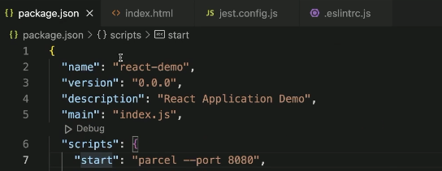
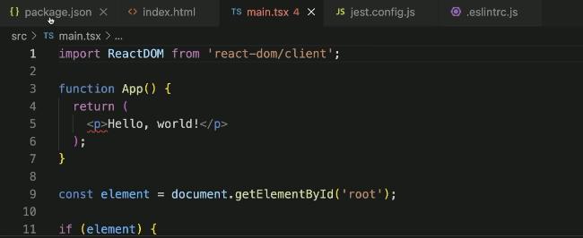
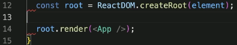

# frontend-survival-week01

## 프론트엔드 개발환경 설정하기

## JavaScript 개발 환경 (Node.js) 세팅

```jsx
fnm install --lts
fnm list
node -v
```

## TypeScript + React + Jest + ESLint + Parcel 개발 환경 세팅

1. 먼저, 적절한 작업 폴더를 준비한다.

```jsx
mkdir my-app
cd my-app
```

2. 여기서 바로 Visual Studio Code를 열면 편하다.

```jsx
code .
```

3. npm 패키지를 준비하는 게 첫 번째 작업.

```jsx
npm init -y
```

4. 잊지 말고 `.gitignore` 파일을 작성한다.  
최소한 `node_modules`를 통째로 커밋하는 황당한 일을 미연에 방지하자. 

```jsx
touch .gitignore
```

- https://www.toptal.com/developers/gitignore/
    
    ```jsx
    # Created by https://www.toptal.com/developers/gitignore/api/node
    # Edit at https://www.toptal.com/developers/gitignore?templates=node
    
    ### Node ###
    # Logs
    logs
    *.log
    npm-debug.log*
    yarn-debug.log*
    yarn-error.log*
    lerna-debug.log*
    .pnpm-debug.log*
    
    # Diagnostic reports (https://nodejs.org/api/report.html)
    report.[0-9]*.[0-9]*.[0-9]*.[0-9]*.json
    
    # Runtime data
    pids
    *.pid
    *.seed
    *.pid.lock
    
    # Directory for instrumented libs generated by jscoverage/JSCover
    lib-cov
    
    # Coverage directory used by tools like istanbul
    coverage
    *.lcov
    
    # nyc test coverage
    .nyc_output
    
    # Grunt intermediate storage (https://gruntjs.com/creating-plugins#storing-task-files)
    .grunt
    
    # Bower dependency directory (https://bower.io/)
    bower_components
    
    # node-waf configuration
    .lock-wscript
    
    # Compiled binary addons (https://nodejs.org/api/addons.html)
    build/Release
    
    # Dependency directories
    node_modules/
    jspm_packages/
    
    # Snowpack dependency directory (https://snowpack.dev/)
    web_modules/
    
    # TypeScript cache
    *.tsbuildinfo
    
    # Optional npm cache directory
    .npm
    
    # Optional eslint cache
    .eslintcache
    
    # Optional stylelint cache
    .stylelintcache
    
    # Microbundle cache
    .rpt2_cache/
    .rts2_cache_cjs/
    .rts2_cache_es/
    .rts2_cache_umd/
    
    # Optional REPL history
    .node_repl_history
    
    # Output of 'npm pack'
    *.tgz
    
    # Yarn Integrity file
    .yarn-integrity
    
    # dotenv environment variable files
    .env
    .env.development.local
    .env.test.local
    .env.production.local
    .env.local
    
    # parcel-bundler cache (https://parceljs.org/)
    .cache
    .parcel-cache
    
    # Next.js build output
    .next
    out
    
    # Nuxt.js build / generate output
    .nuxt
    dist
    
    # Gatsby files
    .cache/
    # Comment in the public line in if your project uses Gatsby and not Next.js
    # https://nextjs.org/blog/next-9-1#public-directory-support
    # public
    
    # vuepress build output
    .vuepress/dist
    
    # vuepress v2.x temp and cache directory
    .temp
    
    # Docusaurus cache and generated files
    .docusaurus
    
    # Serverless directories
    .serverless/
    
    # FuseBox cache
    .fusebox/
    
    # DynamoDB Local files
    .dynamodb/
    
    # TernJS port file
    .tern-port
    
    # Stores VSCode versions used for testing VSCode extensions
    .vscode-test
    
    # yarn v2
    .yarn/cache
    .yarn/unplugged
    .yarn/build-state.yml
    .yarn/install-state.gz
    .pnp.*
    
    ### Node Patch ###
    # Serverless Webpack directories
    .webpack/
    
    # Optional stylelint cache
    
    # SvelteKit build / generate output
    .svelte-kit
    
    # End of https://www.toptal.com/developers/gitignore/api/node
    ```
    
- https://github.com/github/gitignore/blob/main/Node.gitignore
    
    ```jsx
    # Logs
    logs
    *.log
    npm-debug.log*
    yarn-debug.log*
    yarn-error.log*
    lerna-debug.log*
    .pnpm-debug.log*
    
    # Diagnostic reports (https://nodejs.org/api/report.html)
    report.[0-9]*.[0-9]*.[0-9]*.[0-9]*.json
    
    # Runtime data
    pids
    *.pid
    *.seed
    *.pid.lock
    
    # Directory for instrumented libs generated by jscoverage/JSCover
    lib-cov
    
    # Coverage directory used by tools like istanbul
    coverage
    *.lcov
    
    # nyc test coverage
    .nyc_output
    
    # Grunt intermediate storage (https://gruntjs.com/creating-plugins#storing-task-files)
    .grunt
    
    # Bower dependency directory (https://bower.io/)
    bower_components
    
    # node-waf configuration
    .lock-wscript
    
    # Compiled binary addons (https://nodejs.org/api/addons.html)
    build/Release
    
    # Dependency directories
    node_modules/
    jspm_packages/
    
    # Snowpack dependency directory (https://snowpack.dev/)
    web_modules/
    
    # TypeScript cache
    *.tsbuildinfo
    
    # Optional npm cache directory
    .npm
    
    # Optional eslint cache
    .eslintcache
    
    # Optional stylelint cache
    .stylelintcache
    
    # Microbundle cache
    .rpt2_cache/
    .rts2_cache_cjs/
    .rts2_cache_es/
    .rts2_cache_umd/
    
    # Optional REPL history
    .node_repl_history
    
    # Output of 'npm pack'
    *.tgz
    
    # Yarn Integrity file
    .yarn-integrity
    
    # dotenv environment variable files
    .env
    .env.development.local
    .env.test.local
    .env.production.local
    .env.local
    
    # parcel-bundler cache (https://parceljs.org/)
    .cache
    .parcel-cache
    
    # Next.js build output
    .next
    out
    
    # Nuxt.js build / generate output
    .nuxt
    dist
    
    # Gatsby files
    .cache/
    # Comment in the public line in if your project uses Gatsby and not Next.js
    # https://nextjs.org/blog/next-9-1#public-directory-support
    # public
    
    # vuepress build output
    .vuepress/dist
    
    # vuepress v2.x temp and cache directory
    .temp
    .cache
    
    # Docusaurus cache and generated files
    .docusaurus
    
    # Serverless directories
    .serverless/
    
    # FuseBox cache
    .fusebox/
    
    # DynamoDB Local files
    .dynamodb/
    
    # TernJS port file
    .tern-port
    
    # Stores VSCode versions used for testing VSCode extensions
    .vscode-test
    
    # yarn v2
    .yarn/cache
    .yarn/unplugged
    .yarn/build-state.yml
    .yarn/install-state.gz
    .pnp.*
    ```
    
5. 타입스크립트 설정

```jsx
npm i -D typescript

npx tsc --init
```

6. `tsconfig.json` 파일의 jsx 속성 변경한다.
    
    jsx 부분 열어준다. 
    


7. ESLint 설정

```jsx
npm i -D eslint

npx eslint --init
```

```jsx
✔ How would you like to use ESLint? · style // 마지막 3번째 거
✔ What type of modules does your project use? · esm // 맨 위 
✔ Which framework does your project use? · react // 맨 위 
✔ Does your project use TypeScript? · No / Yes // 예스
✔ Where does your code run? · browser // 스페이스 누를 때마다 온오프 가능, 브라우저 선택
✔ How would you like to define a style for your project? · guide // 위에 것, 가이드
✔ Which style guide do you want to follow? · airbnb // 에어비앤비 스타일이 최근에 빠져서 XO
✔ What format do you want your config file to be in? · JavaScript // 자바스크립트
✔ Would you like to install them now? · No / Yes // 예스
✔ Which package manager do you want to use? · npm // npm
```

8. `.eslintrc.js` 파일의 `env`에 `jest`를 추가해준다.

```jsx
env: {
    es2021: true,
    node: true,
		jest: true,
  }
```

9. 잊지 않고 `.eslintignore` 파일을 작성한다.

```jsx
touch .eslintignore
```

```bash
/node_modules/
/dist/
/.parcel-cache/
```

10. 리액트 설치

```bash
npm i react react-dom

npm i -D @types/react @types/react-dom
```

11. 테스팅 도구 설치 

```bash
npm i -D jest @types/jest @swc/core @swc/jest \
    jest-environment-jsdom \
    @testing-library/react @testing-library/jest-dom
```

12. `jest.config.js` 파일을 작성해 테스트에서 SWC를 사용하자.

```bash
touch jest.config.js
```

```bash
module.exports = {
  testEnvironment: 'jsdom',
  setupFilesAfterEnv: [
    '@testing-library/jest-dom/extend-expect',
    './jest.setup',
  ],
  transform: {
    '^.+\\.(t|j)sx?$': ['@swc/jest', {
      jsc: {
        parser: {
          syntax: 'typescript',
          jsx: true,
          decorators: true,
        },
        transform: {
          react: {
            runtime: 'automatic',
          },
        },
      },
    }],
  },
  testPathIgnorePatterns: [
    '<rootDir>/node_modules/',
    '<rootDir>/dist/',
  ],
};
```

```bash
npx eslint .

npx eslint --fix .
```

13. Parcel 설치

```bash
npm i -D parcel
```

14. `package.json` 파일의 scripts를 적절히 수정한다.

```bash
"scripts": {
    "start": "parcel --port 8080",
    "build": "parcel build",
    "check": "tsc --noEmit",
    "lint": "eslint --fix --ext .js,.jsx,.ts,.tsx .",
    "test": "jest",
    "coverage": "jest --coverage --coverage-reporters html",
    "watch:test": "jest --watchAll"
  },
```



main 부분을 `"source": "index.html",` 로 바꿔준다.
15. 기본 코드 작성
    - `index.html`
    - `src/main.tsx`
    - `src/App.tsx`
    - `src/App.test.tsx`
    - `src/components/Greeting.test.tsx`
    - `src/components/Greeting.tsx`

**HTML, JSX 준비**

```bash
touch index.html
```

```html
<!DOCTYPE html>
<html lang="ko">
  <head>
    <meta charset="UTF-8">
    <title>React Demo App</title>
  </head>
  <body>
    <div id="root"></div>
    <script type="module" src="./src/main.tsx"></script>
  </body>
</html>
```

```html
mkdir src
```

```html
touch src/main.tsx
```

```tsx
import ReactDOM from 'react-dom/client';

import App from './App';

const container = document.getElementById('app');

const root = ReactDOM.createRoot(container);

root.render(<App />);
```





- eslintrc.js 파일로 가서 extends 부분으로 가서 순서를 좀 바꿔준다. + plugin 추가

```tsx
extends: [
    'plugin:react/recommended',
    'plugin:react/jsx-runtime',
    'xo'
  ],
```

```tsx
npm run lint
```

## Parcel

`package.json` 파일에 source 속성 추가.

```json
"source": "./index.html",
```

[parcel-reporter-static-files-copy](https://github.com/elwin013/parcel-reporter-static-files-copy) 패키지 설치 후 `.parcelrc` 파일 작성.   
이렇게 하면 static 폴더의 파일을 정적 파일로 Serving할 수 있다(이미지 등 Assets).

```tsx
touch .parcelrc
```

```json
{
  "extends": ["@parcel/config-default"],
  "reporters":  ["...", "parcel-reporter-static-files-copy"]
}
```

빌드 + 정적 서버 실행

```tsx
npx parcel build

npx servor ./dist
```

## ESLint

```tsx
mkdir .vscode

touch .vscode/settings.json
```

```tsx
{
    "editor.rulers": [
        80
    ],
    "editor.codeActionsOnSave": {
        "source.fixAll.eslint": true
    },
    "trailing-spaces.trimOnSave": true
}
```
